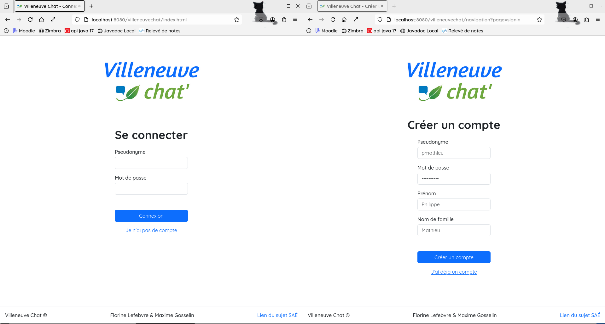
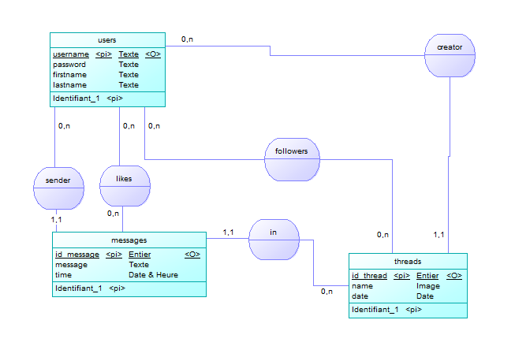

# Villeneuve Chat

## Description de l'application

L'application VilleneuveChat permet de discuter au travers de "fils". Chaque utilisateur peut créer son fil et tout le monde peut rejoindre chaque fil.

### Utilisation

Sur Villeneuve Chat, créer un fil de discussion est très simple.
Cliquez sur l'icône de création de fil située dans la barre de navigation.
Cela vous permettra de créer un nouveau fil. Il vous suffit ensuite de choisir un titre pour votre fil, puis de publier.
Votre fil est immédiatement créé et prêt à accueillir des messages, permettant ainsi aux autres utilisateurs de rejoindre la conversation et d'échanger avec vous.

Rejoindre un fil sur Villeneuve Chat est facile. Il vous suffit de parcourir les fils disponibles pour trouver celui qui vous intéresse. Une fois que vous avez trouvé un fil, cliquez simplement sur le bouton "suivre" pour entrer dans la discussion. Vous pourrez alors lire les messages précédents et y répondre, en ajoutant votre propre contribution à la conversation. C’est un moyen rapide de participer aux échanges et de rester informé des derniers développements sur les sujets qui vous passionnent.

Pour consulter les fils que vous suivez sur Villeneuve Chat, il vous suffit de cliquer sur l'icone des fils suivis. Vous y trouverez tous les fils auxquels vous êtes abonné. En cliquant sur l’un d’eux, vous pourrez voir les dernières mises à jour et répondre aux nouveaux messages. Cela vous permet de rester à jour sur les discussions qui vous intéressent sans avoir à rechercher constamment les fils.

Pour accéder à vos informations, allez dans l'onglet compte. Vous pouvez y modifier votre mot de passe, prénom et votre nom, et voir vos fils créés. 

## Visuels

Le front du site a été fait avec bootstrap et c'est responsive !


*Capture d'écran de la page de connexion à gauche, et celle de création de compte à droite*


*Capture d'écran de la page d'accueil à gauche, et celle de création de fil à droite*


*Capture d'écran de la page de modification de compte, version pc à gauche et mobile à droite*


*Capture d'écran de la page montrant nos fils suivis, version pc à gauche et mobile à droite*


*Capture d'écran du fil "Les Memes de l IUT" à gauche, et sa version mobile à droite avec la liste des utilisateurs du fil affichée*

## Configuration
Afin de modifier la configuration du serveur pour utiliser votre propre base de données,
Il faut modifier le fichier `./WEB-INF/config.prop`. Il faut également initialiser
la base de données en utilisant le script `./baseDeDonnee/init.sql`.

### Utilisation d'une BBD de test sous conteneur podman (facultatif)
Des scripts sont à votre dispositions dans le répertoire `./scripts` pour permettre de créer un conteneur podman avec une bdd postgres dedans et modifier le fichier de configuration pour pouvoir l'utiliser. Il y a aussi les fichier `./scripts/delete_the_podman_psql_container.sh` et `scripts/reset_configprop.sh` pour respectivement supprimer le conteneur postgres et remettre l'ancien fichier de configuration (utilisant le compte de maxime).

## MCD et MLD
Voici le MCD et le MLD que nous avons utilisé pour la base de donnée de notre application



## Requête de base en SQL
Voici quelques requetes que nous avons créé au début.

La requête permettant de récuperer tous les messages du fil 5:
```
SELECT sender, message, time 
FROM messages
WHERE id_thread = 5
ORDER BY time ASC;
```

La requête permettant de récuperer tous les utilisateurs du fil 5:
```
SELECT username, firstname, lastname 
FROM users JOIN followers USING (username)
WHERE id_thread = 5;
```

La requête permettant de créer un thread par l'utilisatrice Florine, avec le nom 'Chats et Douceur'
```
INSERT INTO threads (creator, name, date)
VALUES ('florine', 'Chats et douceur', '2005-06-08');
```

La requête permettant d'envoyer un message
```
INSERT INTO messages (sender, id_thread, message, time)
VALUES ('maxime', 5, 'Je suis une fleur', now());
```

Le reste des requêtes se trouve dans le dossier `./baseDeDonnee/requetes`.

## Arborescence globale du projet

Le projet est basé sur l'architecture MVC : 
- le **modele** se situe dans `WEB-INF/src/modele` séparé avec 2 packages `dao` et `dto`
- les **controleurs** dans `WEB-INF/src/controleur`
- les **vues** sont dans `WEB-INF/vue` pour quelles ne soient pas routables

Les fichiers .class compilent dans `WEB-INF/classes`